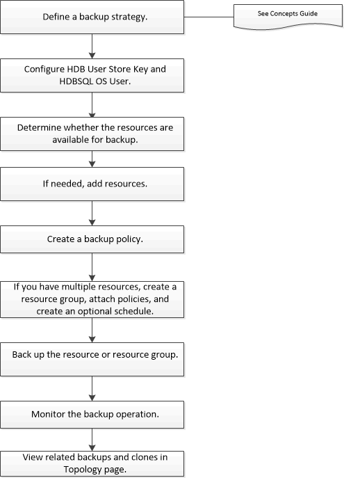

= Sichern von SAP HANA-Ressourcen
:allow-uri-read: 
:icons: font
:imagesdir: ../media/

[role="lead"]
Sie können entweder eine Sicherung einer Ressource (Datenbank) oder einer Ressourcengruppe erstellen.  Der Sicherungsworkflow umfasst die Planung, die Identifizierung der zu sichernden Datenbanken, die Verwaltung von Sicherungsrichtlinien, das Erstellen von Ressourcengruppen und Anhängen von Richtlinien, das Erstellen von Sicherungen und die Überwachung der Vorgänge.

Der folgende Arbeitsablauf zeigt die Reihenfolge, in der Sie den Sicherungsvorgang durchführen müssen:

Sie können PowerShell-Cmdlets auch manuell oder in Skripts verwenden, um Sicherungs-, Wiederherstellungs- und Klonvorgänge durchzuführen.  Die SnapCenter -Cmdlet-Hilfe und die Cmdlet-Referenzinformationen enthalten weitere Informationen zu PowerShell-Cmdlets. https://docs.netapp.com/us-en/snapcenter-cmdlets/index.html["Referenzhandbuch für SnapCenter -Software-Cmdlets"^] .
