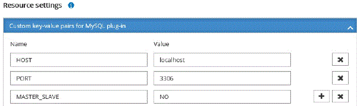

= Ressourcen zu NetApp unterstützten Plug-ins hinzufügen
:allow-uri-read: 
:icons: font
:imagesdir: ../media/

[role="lead"]
Sie müssen die Ressourcen hinzufügen, die Sie sichern oder klonen möchten.  Abhängig von Ihrer Umgebung können die Ressourcen entweder Datenbankinstanzen oder Sammlungen sein, die Sie sichern oder klonen möchten.

.Bevor Sie beginnen
* Sie müssen Aufgaben wie die Installation des SnapCenter -Servers, das Hinzufügen von Hosts, das Erstellen von Speichersystemverbindungen und das Hinzufügen von Anmeldeinformationen abgeschlossen haben.
* Sie müssen die Plug-Ins auf den SnapCenter -Server hochgeladen haben.

.Schritte
. Wählen Sie im linken Navigationsbereich *Ressourcen* und wählen Sie dann das entsprechende Plug-In aus der Liste aus.
. Wählen Sie auf der Seite „Ressourcen“ die Option „Ressource hinzufügen“ aus.
. Führen Sie auf der Seite „Ressourcendetails angeben“ die folgenden Aktionen aus:
+
|===
| Für dieses Feld... | Machen Sie Folgendes... 

 a| 
Name
 a| 
Geben Sie den Namen der Ressource ein.

 a| 
Hostname
 a| 
Wählen Sie den Host aus.

 a| 
Typ
 a| 
Wählen Sie den Typ aus.  Der Typ wird gemäß der Plug-In-Beschreibungsdatei vom Benutzer definiert.  Zum Beispiel Datenbank und Instanz.

Falls der ausgewählte Typ ein übergeordnetes Element hat, geben Sie die Details des übergeordneten Elements ein.  Wenn der Typ beispielsweise „Datenbank“ und das übergeordnete Element „Instanz“ ist, geben Sie die Details der Instanz ein.

 a| 
Anmeldeinformationsname
 a| 
Wählen Sie Anmeldeinformationen aus oder erstellen Sie neue Anmeldeinformationen.

 a| 
Bergpfade
 a| 
Geben Sie die Mount-Pfade ein, in denen die Ressource gemountet ist.  Dies gilt nur für einen Windows-Host.

|===
. Wählen Sie auf der Seite „Speicherbedarf angeben“ ein Speichersystem und ein oder mehrere Volumes, LUNs und Qtrees aus und wählen Sie dann *Speichern*.
+
Optional: Wählen Sie dieimage:../media/add_policy_from_resourcegroup.gif["Plus-Symbol"] Symbol, um weitere Volumes, LUNs und Qtrees aus anderen Speichersystemen hinzuzufügen.

+

NOTE: Von NetApp unterstützte Plug-Ins unterstützen keine automatische Erkennung der Ressourcen.  Auch die Speicherdetails physischer und virtueller Umgebungen werden nicht automatisch erkannt.  Sie müssen beim Erstellen der Ressourcen die Speicherinformationen für physische und virtuelle Umgebungen angeben.

+
image::../media/storage_footprint.png[Speicherbedarf]

. Geben Sie auf der Seite „Ressourceneinstellungen“ benutzerdefinierte Schlüssel-Wert-Paare für die Ressource an.
+

NOTE: Stellen Sie sicher, dass der Name des benutzerdefinierten Schlüssels in Großbuchstaben geschrieben ist.

+

+
Die jeweiligen Plug-In-Parameter finden Sie unterlink:add_resources_to_netapp_supported_plugins.html#parameters-to-configure-the-resource["Parameter zum Konfigurieren der Ressource"]

. Überprüfen Sie die Zusammenfassung und wählen Sie dann *Fertig*.

.Ergebnis
Die Ressourcen werden zusammen mit Informationen wie Typ, Host- oder Clustername, zugehörigen Ressourcengruppen und Richtlinien sowie dem Gesamtstatus angezeigt.

IMPORTANT: Sie müssen die Ressourcen aktualisieren, wenn die Datenbanken außerhalb von SnapCenter umbenannt werden.

.Nach Abschluss
Wenn Sie anderen Benutzern Zugriff auf die Assets gewähren möchten, muss der SnapCenter Administrator diesen Benutzern Assets zuweisen.  Dadurch können Benutzer die Aktionen ausführen, für die sie über Berechtigungen für die ihnen zugewiesenen Assets verfügen.

Nachdem Sie die Ressourcen hinzugefügt haben, können Sie die Ressourcendetails ändern.  Wenn einer von NetApp unterstützten Plug-In-Ressource Sicherungen zugeordnet sind, können die folgenden Felder nicht geändert werden: Ressourcenname, Ressourcentyp und Hostname.

== Parameter zum Konfigurieren der Ressource

Wenn Sie die Plug-Ins manuell hinzufügen, können Sie die Ressource auf der Seite „Ressourceneinstellungen“ mit den folgenden Parametern konfigurieren.

=== Plug-in für MongoDB

Ressourceneinstellungen:

* MONGODB_APP_SERVER=(für Ressourcentyp als Sharded Cluster) oder MONGODB_REPLICASET_SERVER=(für Ressourcentyp als Replikatsatz)
* OPLOG_PATH=(Optionaler Parameter, falls er von MongoDB.propertiesfile bereitgestellt wird)
* MONGODB_AUTHENTICATION_TYPE= (PLAIN für LDAP-Authentifizierung und Keine für andere)

Sie müssen die folgenden Parameter in der Datei MongoDB.properties angeben:

* DISABLE_STARTING_STOPPING_SERVICES=
+
** N, wenn die Start-/Stopp-Dienste vom Plug-In ausgeführt werden.
** Y, wenn Start-/**Stopp-Dienste vom Benutzer ausgeführt werden.
** Optionaler Parameter, da der Standardwert auf N gesetzt ist.

* OPLOG_PATH_= (Optionaler Parameter, falls er bereits als benutzerdefiniertes Schlüssel-Wert-Paar in SnapCenter bereitgestellt wird).

=== Plug-in für MaxDB

Ressourceneinstellungen:

* XUSER_ENABLE (Y|N) aktiviert oder deaktiviert die Verwendung eines Xusers für MaxDB, sodass für den Datenbankbenutzer kein Kennwort erforderlich ist.
* HANDLE_LOGWRITER (Y|N) führt die Operationen „Logwriter anhalten“ (N) oder „Logwriter fortsetzen“ (Y) aus.
* DBMCLICMD (path_to_dbmcli_cmd) gibt den Pfad zum MaxDB-dbmcli-Befehl an.  Wenn nicht festgelegt, wird dbmcli im Suchpfad verwendet.

NOTE: In einer Windows-Umgebung muss der Pfad in doppelte Anführungszeichen ("...") eingeschlossen sein.

* SQLCLICMD (path_to_sqlcli_cmd) gibt den Pfad zum MaxDB-SQLCLI-Befehl an.  Wenn der Pfad nicht festgelegt ist, wird sqlcli auf den Suchpfad angewendet.
* MAXDB_UPDATE_HIST_LOG (Y|N) weist das MaxDB-Sicherungsprogramm an, ob es das MaxDB-Verlaufsprotokoll aktualisieren soll.
* MAXDB_CHECK_SNAPSHOT_DIR: Beispiel: SID1:Verzeichnis[,Verzeichnis...]; [SID2:Verzeichnis[,Verzeichnis...] prüft, ob ein Snap Creator-Snapshot-Kopiervorgang erfolgreich ist, und stellt sicher, dass der Snapshot erstellt wird.
+
Dies gilt nur für NFS.  Das Verzeichnis muss auf den Speicherort verweisen, der das Verzeichnis .snapshot enthält.  Mehrere Verzeichnisse können in einer durch Kommas getrennten Liste enthalten sein.

+
In MaxDB 7.8 und späteren Versionen wird die Datenbanksicherungsanforderung im Sicherungsverlauf als „Fehlgeschlagen“ markiert.

* MAXDB_BACKUP_TEMPLATES: Gibt eine Sicherungsvorlage für jede Datenbank an.
+
Die Vorlage muss vorhanden sein und ein externer Typ einer Sicherungsvorlage sein.  Um die Snapshot-Integration für MaxDB 7.8 und höher zu aktivieren, müssen Sie über die MaxDB-Hintergrundserverfunktionalität und eine bereits konfigurierte MaxDB-Sicherungsvorlage des Typs EXTERNAL verfügen.

* MAXDB_BG_SERVER_PREFIX: Gibt das Präfix für den Hintergrundservernamen an.
+
Wenn der Parameter MAXDB_BACKUP_TEMPLATES festgelegt ist, müssen Sie auch den Parameter MAXDB_BG_SERVER_PREFIX festlegen.  Wenn Sie das Präfix nicht festlegen, wird der Standardwert na_bg_ verwendet.

=== Plug-in für SAP ASE

Ressourceneinstellungen:

* SYBASE_SERVER (data_server_name) gibt den Namen des Sybase-Datenservers an (Option -S im isql-Befehl).  Zum Beispiel p_test.
* SYBASE_DATABASES_EXCLUDE (db_name) ermöglicht das Ausschließen von Datenbanken, wenn die Konstruktion „ALL“ verwendet wird.
+
Sie können mehrere Datenbanken angeben, indem Sie eine durch Semikolon getrennte Liste verwenden.  Beispiel: pubs2;test_db1.

* SYBASE_USER: user_name gibt den Betriebssystembenutzer an, der den isql-Befehl ausführen kann.
+
Erforderlich für UNIX.  Dieser Parameter ist erforderlich, wenn der Benutzer, der die Start- und Stoppbefehle des Snap Creator Agent ausführt (normalerweise der Root-Benutzer), und der Benutzer, der den isql-Befehl ausführt, unterschiedlich sind.

* SYBASE_TRAN_DUMP db_name:directory_path ermöglicht Ihnen, nach dem Erstellen eines Snapshots einen Sybase-Transaktionsdump durchzuführen.  Beispiel: pubs2:/sybasedumps/pubs2
+
Sie müssen jede Datenbank angeben, die einen Transaktionsdump erfordert.

* SYBASE_TRAN_DUMP_COMPRESS (Y|N) aktiviert oder deaktiviert die native Sybase-Transaktionsdump-Komprimierung.
* SYBASE_ISQL_CMD (z. B. /opt/sybase/OCS-15_0/bin/isql) definiert den Pfad zum isql-Befehl.
* Mit SYBASE_EXCLUDE_TEMPDB (Y|N) können Sie vom Benutzer erstellte temporäre Datenbanken automatisch ausschließen.

=== Plug-in für Oracle-Anwendungen (ORASCPM)

Ressourceneinstellungen:

* SQLPLUS_CMD gibt den Pfad zu SQLplus an.
* ORACLE_DATABASES listet die zu sichernden Oracle-Datenbanken und den entsprechenden Benutzer (Datenbank:Benutzer) auf.
* CNTL_FILE_BACKUP_DIR gibt das Verzeichnis für die Sicherung der Steuerdatei an.
* ORA_TEMP gibt das Verzeichnis für temporäre Dateien an.
* ORACLE_HOME gibt das Verzeichnis an, in dem die Oracle-Software installiert ist.
* ARCHIVE_LOG_ONLY gibt an, ob die Archivprotokolle gesichert werden sollen oder nicht.
* ORACLE_BACKUPMODE gibt an, ob eine Online- oder Offline-Sicherung durchgeführt werden soll.
* ORACLE_EXPORT_PARAMETERS gibt an, ob die oben definierten Umgebungsvariablen während der Ausführung von _/bin/su <Benutzer, der sqlplus ausführt> -c sqlplus /nolog <cmd>_ erneut exportiert werden sollen.  Dies ist normalerweise der Fall, wenn der Benutzer, der sqlplus ausführt, nicht alle Umgebungsvariablen festgelegt hat, die für die Verbindung mit der Datenbank mithilfe von _connect / as sysdba_ erforderlich sind.

