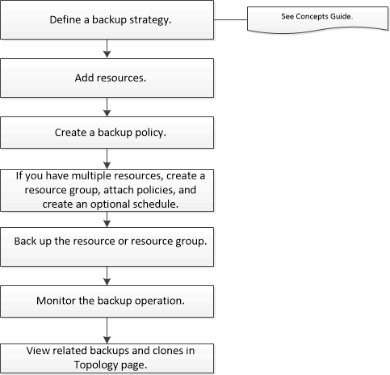

= Sichern Sie von NetApp unterstützte Plug-In-Ressourcen
:allow-uri-read: 
:icons: font
:imagesdir: ../media/

[role="lead"]
Der Sicherungsworkflow umfasst die Planung, die Identifizierung der Ressourcen für die Sicherung, die Verwaltung von Sicherungsrichtlinien, das Erstellen von Ressourcengruppen und Anhängen von Richtlinien, das Erstellen von Sicherungen und die Überwachung der Vorgänge.

Der folgende Arbeitsablauf zeigt die Reihenfolge, in der Sie den Sicherungsvorgang durchführen müssen:

Sie können PowerShell-Cmdlets auch manuell oder in Skripts verwenden, um Sicherungs-, Wiederherstellungs- und Klonvorgänge durchzuführen.  Ausführliche Informationen zu PowerShell-Cmdlets finden Sie in der SnapCenter -Cmdlet-Hilfe oder im https://docs.netapp.com/us-en/snapcenter-cmdlets/index.html["Referenzhandbuch für SnapCenter -Software-Cmdlets"]
