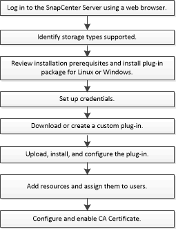

= Installationsablauf der von SnapCenter NetApp unterstützten Plug-Ins
:allow-uri-read: 
:icons: font
:imagesdir: ../media/

[role="lead"]
Sie sollten von SnapCenter NetApp unterstützte Plug-Ins installieren und einrichten, wenn Sie von NetApp unterstützte Plug-In-Ressourcen schützen möchten.

