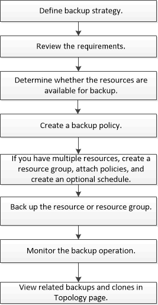

= Übersicht über das Backup-Verfahren
:allow-uri-read: 
:icons: font
:imagesdir: ../media/

[role="lead"]
Sie können entweder eine Sicherung einer Ressource (Datenbank) oder einer Ressourcengruppe erstellen.  Das Sicherungsverfahren umfasst die Planung, die Identifizierung der Ressourcen für die Sicherung, die Erstellung von Sicherungsrichtlinien, die Erstellung von Ressourcengruppen und das Anhängen von Richtlinien, die Erstellung von Sicherungen und die Überwachung der Vorgänge.

Der folgende Arbeitsablauf zeigt die Reihenfolge, in der Sie den Sicherungsvorgang durchführen müssen:

Beim Erstellen einer Sicherung für Oracle-Datenbanken wird auf dem Oracle-Datenbankhost im Verzeichnis _/var/opt/snapcenter/sco/lock_ eine Betriebssperrdatei (_.sm_lock_dbsid_) erstellt, um zu vermeiden, dass mehrere Vorgänge auf der Datenbank ausgeführt werden.  Nach der Sicherung der Datenbank wird die Betriebssperrdatei automatisch entfernt.

Wenn die vorherige Sicherung jedoch mit einer Warnung abgeschlossen wurde, wird die Betriebssperrdatei möglicherweise nicht gelöscht und der nächste Sicherungsvorgang wird in die Warteschlange gestellt.  Es kann eventuell abgebrochen werden, wenn die Datei *.sm_lock_dbsid* nicht gelöscht wird.  In einem solchen Szenario müssen Sie die Betriebssperrdatei manuell löschen, indem Sie die folgenden Schritte ausführen:

. Navigieren Sie in der Eingabeaufforderung zu _/var/opt/snapcenter/sco/lock_.
. Löschen der Betriebssperre:``rm -rf .sm_lock_dbsid.``

