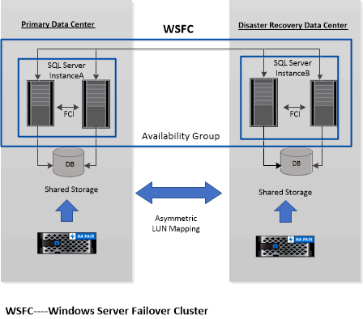

= Unterstützung für asymmetrische LUN-Zuordnung in Windows-Clustern
:allow-uri-read: 
:icons: font
:imagesdir: ../media/

[role="lead"]
Das SnapCenter -Plug-in für Microsoft SQL Server unterstützt die Erkennung in SQL Server 2012 und höher, ALM-Konfigurationen (Asymmetric LUN Mapping) für hohe Verfügbarkeit und Verfügbarkeitsgruppen für die Notfallwiederherstellung.  Beim Erkennen von Ressourcen erkennt SnapCenter Datenbanken auf lokalen Hosts und auf Remote-Hosts in ALM-Konfigurationen.

Eine ALM-Konfiguration ist ein einzelner Windows-Server-Failovercluster, der einen oder mehrere Knoten in einem primären Rechenzentrum und einen oder mehrere Knoten in einem Notfallwiederherstellungszentrum enthält.

Nachfolgend sehen Sie ein Beispiel für eine ALM-Konfiguration:

* Zwei Failovercluster-Instanzen (FCI) in einem Rechenzentrum mit mehreren Standorten
* FCI für lokale Hochverfügbarkeit (HA) und Verfügbarkeitsgruppe (AG) für Notfallwiederherstellung mit einer eigenständigen Instanz am Notfallwiederherstellungsstandort

Der Speicher im primären Rechenzentrum wird zwischen den im primären Rechenzentrum vorhandenen FCI-Knoten gemeinsam genutzt.  Der Speicher im Notfallwiederherstellungs-Rechenzentrum wird zwischen den im Notfallwiederherstellungs-Rechenzentrum vorhandenen FCI-Knoten gemeinsam genutzt.

Der Speicher im primären Rechenzentrum ist für die Knoten im Notfallwiederherstellungs-Rechenzentrum nicht sichtbar und umgekehrt.

Die ALM-Architektur kombiniert zwei gemeinsam genutzte Speicherlösungen, die von FCI verwendet werden, mit einer nicht gemeinsam genutzten oder dedizierten Speicherlösung, die von SQL AG verwendet wird.  Die AG-Lösung verwendet identische Laufwerksbuchstaben für gemeinsam genutzte Festplattenressourcen in allen Rechenzentren.  Diese Speicheranordnung, bei der eine Clusterfestplatte von einer Teilmenge von Knoten innerhalb eines WSFC gemeinsam genutzt wird, wird als ALM bezeichnet.
